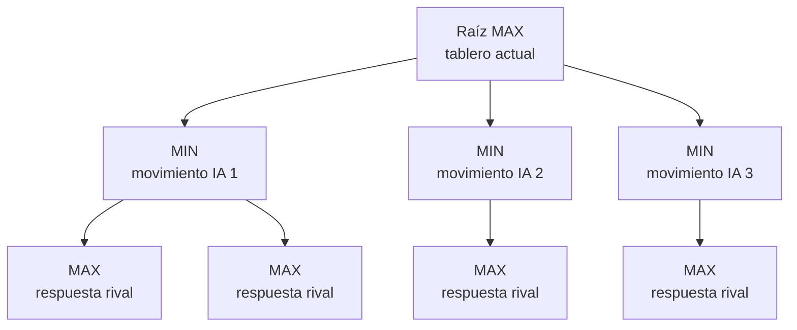

# Memoria técnica

## Objetivo

El proyecto implementa un agente para Othello mediante Minimax con profundidad 4,
tres heurísticas seleccionables y poda alfa-beta. La única modificación funcional
de la práctica se encuentra en `Assets/Scripts/Player.cs`.

## Representación del árbol

Cada objeto `Node` representa un estado posible de la partida:

- `board`: copia independiente de las 64 casillas.
- `parent`: nodo anterior.
- `childList`: estados alcanzables.
- `type`: indica si es un nodo MIN o MAX.
- `utility`: valor propagado.
- `alfa` y `beta`: límites usados durante la poda.

La raíz representa el tablero real antes de que mueva la IA y es de tipo MAX.
Cada hijo de la raíz corresponde a uno de sus movimientos legales.

## Recorrido Minimax

`SelectTile` obtiene los movimientos legales de la IA. Para cada movimiento crea
un nodo hijo, aplica el movimiento sobre una copia del tablero y llama a `Minimax`.

La función recursiva alterna:

- MAX conserva la mayor utilidad porque representa a la IA.
- MIN conserva la menor utilidad porque representa la respuesta más perjudicial
  que puede escoger el rival.

Al alcanzar profundidad 0 se aplica la heurística seleccionada. Si ninguno de los
jugadores puede mover, se usa una utilidad terminal que prioriza siempre victoria,
empate o derrota sobre cualquier valoración intermedia.

## Gestión del pase

Si el jugador actual no tiene movimientos, se comprueba al rival:

- Si el rival tampoco puede mover, la partida termina.
- Si el rival sí puede mover, se crea un hijo con el mismo tablero y se cambia el
  turno. De esta forma el pase forma parte del árbol.

## Heurísticas

### H1: diferencia de fichas

Calcula:

`fichas de la IA - fichas del rival`

Es una heurística básica y directa. Favorece capturas inmediatas, aunque puede
priorizar demasiadas fichas en fases tempranas.

### H2: movilidad

Calcula:

`movimientos disponibles de la IA - movimientos disponibles del rival`

Busca conservar opciones futuras y limitar las respuestas del oponente. No utiliza
el número actual de fichas.

### H3: estrategia posicional

Valora cada esquina con `+100` o `-100`. Mientras una esquina está vacía, penaliza
con `-25` las tres casillas adyacentes ocupadas por la IA y premia con `+25` que
las ocupe el rival. Una vez capturada la esquina, esas casillas dejan de ser
peligrosas. La diferencia de fichas se usa únicamente como desempate secundario.

H3 no es una combinación lineal de H1 y H2: aplica condiciones posicionales que
dependen del estado de cada esquina.

## Poda alfa-beta

Alpha contiene el mejor valor conocido por MAX y beta el mejor conocido por MIN.
Después de valorar cada hijo:

- MAX actualiza alpha.
- MIN actualiza beta.
- Si `beta <= alpha`, las ramas restantes no pueden cambiar la decisión y se
  interrumpe su exploración.

La poda reduce el trabajo sin modificar el resultado de Minimax.

## Configuración

`heuristicType` aparece en el Inspector del componente `Player`:

- `1`: H1.
- `2`: H2.
- `3`: H3.

La profundidad está fijada en 4 mediante `MaxDepth`.

## Herramientas utilizadas

Se utilizó ChatGPT como apoyo puntual para resolver algunas dudas y organizar la
explicación del proyecto. La implementación, las pruebas y la revisión final han
sido realizadas por el equipo.
